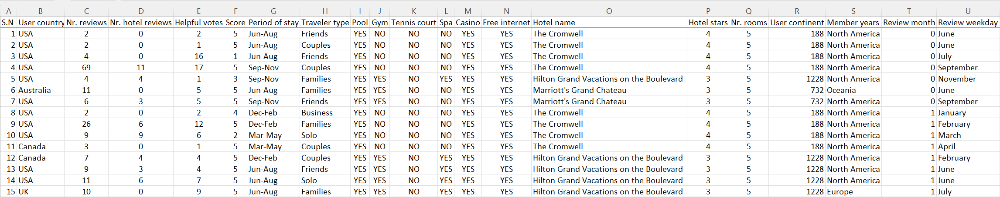
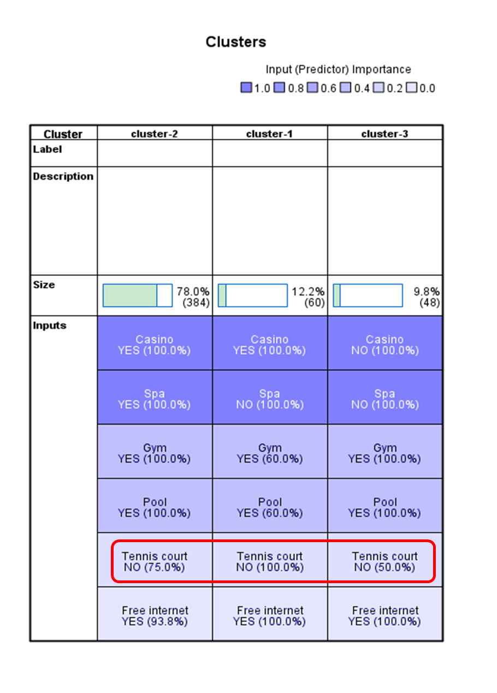

## IBM K-Means

### K-Means analysis using SPSS

Mock data comprising of 504 records of hotel reviews by travellers was fed into SPSS. The data included information of travellers, their traveling periods, hotel reviews and facilities.

Clustering was carried out using the K-Means module in SPSS to identify clusters or combinations of hotel facilities preferred by travellers. For instance, were all six facilities, namely Casino, Spa, Free internet, Gym, Pool, and Tennis court, important to travellers? If not, what combinations of facilities were important to them?

K-Means using SPSS is easy. It allows the user to determine the size of clusters according to one’s whims and fancies. Whether each determination makes sense or not, I am not sure. So I ran the program, setting cluster sizes from 2 to 7 and results started getting meaningless as cluster sizes increased. Adopting Occam’s razor principle in problem-solving whereby when two competing analyses provide the same outcome, the simpler analytical model should be adopted. Hence, the output from the three clusters analysis was adopted.

### Sometimes, it is the ‘not so obvious’
We often look at the obvious, such as what pairs well together – spa and casino, spa and gym, spa and others. Then, a further look at the result revealed that most travellers did not consider a tennis court a must-have. So, what would you do with this finding?

<a style="font-weight:bold" href="https://KenYeoKP.github.io">Return to posts and repositories</a>
