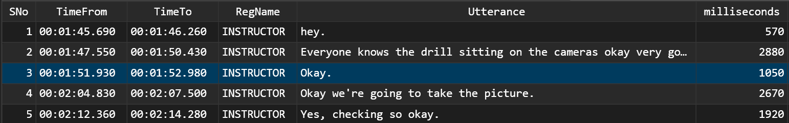

## Data Wrangling

### exercise "SPEAK UP"

The COVID-19 pandemic revolutionised education by accelerating the adoption of digital tools, with Zoom emerging as a pivotal platform. Zoom enabled educators to conduct live lectures, facilitate interactive discussions, and maintain a sense of community despite physical distancing. This shift not only allowed for the immediate continuation of education but also paved the way for a more flexible, hybrid model of learning that is likely to persist beyond the pandemic.

Class participation in Zoom lectures has transformed traditional educational dynamics, offering both challenges and opportunities. Since speaking, debating and contributing ideas in an adult-learning environment are important to developing critical thinking and collaborative skills, it is crucial to measure the level of class participation in Zoom. So how does one determine the level of class participation of a student in a Zoom environment?

An auto-generated transcript from a Zoom class looks like this:

    WEBVTT
    
    1
    00:01:45.690 --> 00:01:46.260
    INSTRUCTOR: hey.
    
    2
    00:01:47.550 --> 00:01:50.430
    INSTRUCTOR: Everyone knows the drill sitting on the cameras okay very good.
    
    3
    00:01:51.930 --> 00:01:52.980
    INSTRUCTOR: Okay.
    
    4
    00:02:04.830 --> 00:02:07.500
    INSTRUCTOR: Okay we're going to take the picture.
    
    5
    00:02:12.360 --> 00:02:14.280
    INSTRUCTOR: Yes, checking so okay

### and now we wrangle, with a Python of course
It was my first experience with Python programming and I quickly learned that its fussiness over syntax is like having a grammar-loving parrot perched on your shoulder, constantly squawking about indentation and backslashes. But to deal with the given data format, Python is the way to go. After much wrangling, I generated a table with five columns: SNo, TimeFrom, TimeTo, RegName and Utterance. This data-driven approach ensured that all students who were actively involved in classes were measured appropriately.

    SNo	TimeFrom    TimeTo	RegName	        Utterance
    1	01:45.7	    01:46.3	INSTRUCTOR	hey.
    2	01:47.5	    01:50.4	INSTRUCTOR	Everyone knows the drill sitting on the cameras okay very good.
    3	01:51.9	    01:53.0	INSTRUCTOR	Okay.
    4	02:04.8	    02:07.5	INSTRUCTOR	Okay we're going to take the picture.
    5	02:12.4	    02:14.3	INSTRUCTOR	Yes, checking so okay.

### right tool for the job
There were some data cleaning activities to perform to get the TimeFrom and TimeTo into a time string format in milliseconds (for summing purposes later on). Although Python is capable of doing that, but using SQL makes my life easier—like using a wine opener for wine corks instead of a screwdriver.

<a style="font-weight:bold" href="https://KenYeoKP.github.io">Return to posts and repositories</a>

Once the time format was in order, the R program was used to plot a horizontal bar chart to show which student babbled the most in classes. I’m not sure if marks for class participation were awarded in this manner, but my work for this exercise is done here. 😎

