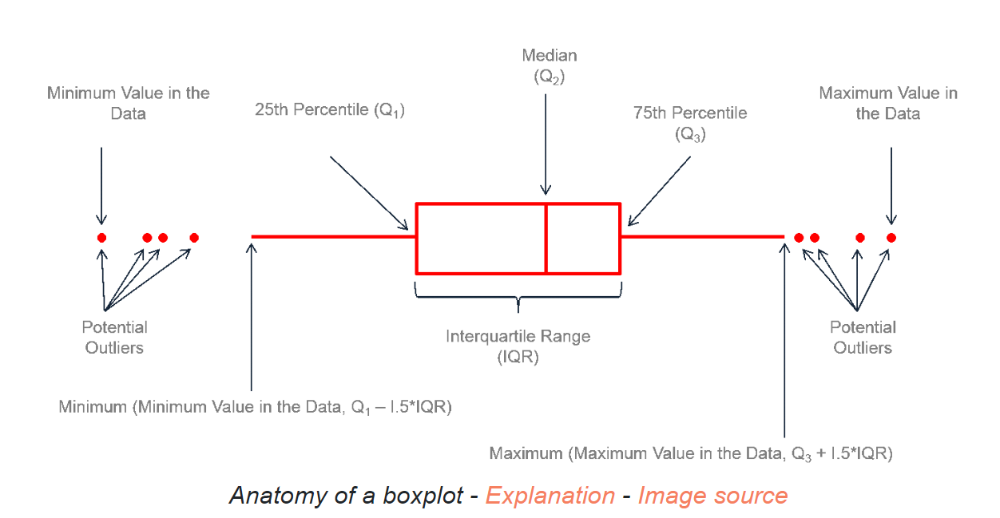
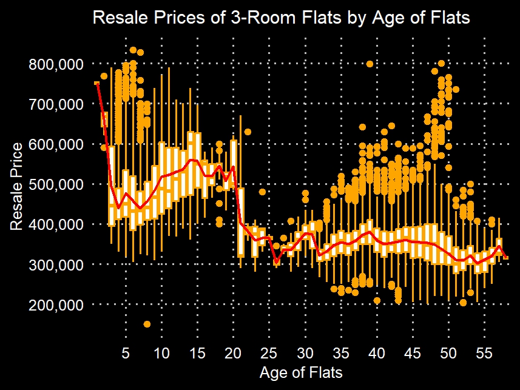
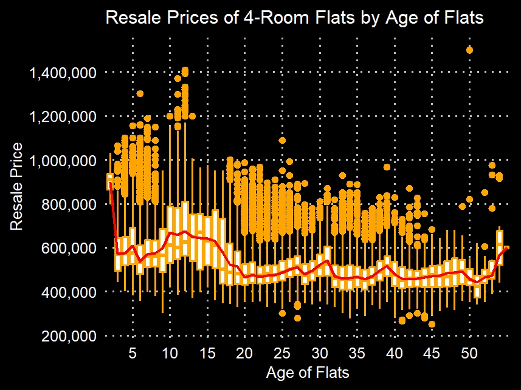
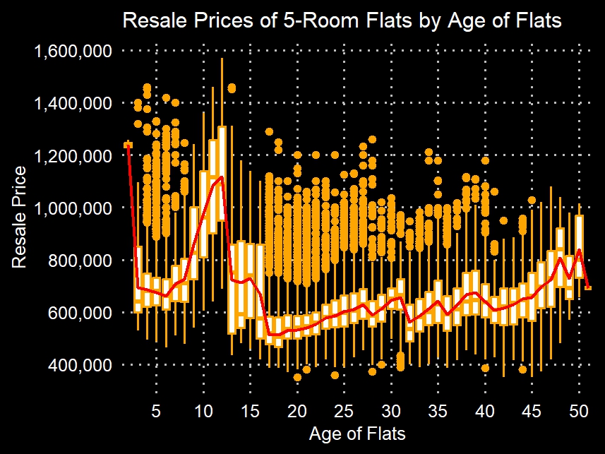
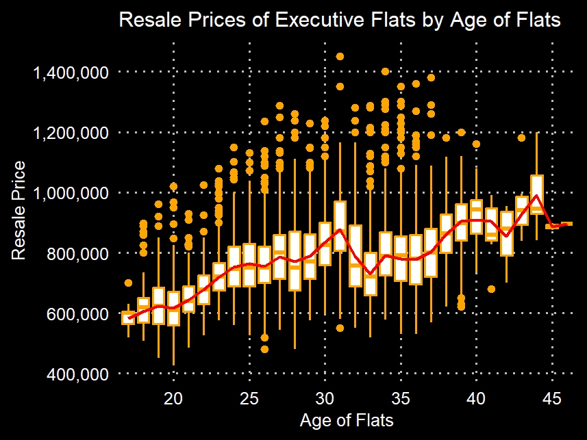

## Data Visualisation

### Uncovering trends in HDB resale market

#### *A Visualisation Project*

Visit <a href="https://data.gov.sg/">data.gov.sg</a> to obtain national dataset for exploration, it's a great place to obtain stats as from there as they are generally clean, reliable and valid. As such, there is not much of data wrangling needed, however one still needs to check to ensure the data is consistent when merging datasets from different datasets.

Using the R’s boxplot function, I was able to create charts showing the median resale prices of 3, 4, 5-room and executive flats. Features of a boxplot are summarised as follows:
  
*Source: https://r-graph-gallery.com/boxplot.html*

  
Once the framework for the chart was established, plotting various charts became easy. Resuing codes not only streamlines coding but ensures consistency, reduces bugs, and boosts efficiency. So when coding, think of reusability and let it transform the software development into a smooth, joyful experience.

    # plot for 3 room
    p3 <- ggplot(df2124.3rm, aes(x = factor(age_sold), y = resale_price)) +
      geom_boxplot(color = 'orange', fill = 'white') +
      geom_smooth(data = avg_prices.3rm, aes(x = factor(age_sold), 
                                           y = avg_resale_price, group = 1),
                                           color = 'blue', size = 1.3, se=FALSE) +
      labs(title = "Resale Prices of 3-Room Flats by Age of Flats",
           x = "Age of Flats",
           y = "Resale Price") +
      theme(plot.title = element_text(color = 'white', size = 18, hjust = 0.5),
            panel.grid.minor.y = element_blank(),
            panel.grid.major.y = element_line(color = "grey", linetype = 'dotted'),
            panel.grid.minor.x = element_blank(),
            panel.grid.major.x = element_line(color = "grey", linetype = 'dotted'),
            panel.background = element_rect(fill = "black"),
            plot.background = element_rect(fill = "black"),
            axis.text = element_text(color = 'white'),
            axis.title = element_text(color = 'white'),
            legend.text = element_text(color = 'white'),
            legend.title = element_text(color = 'white')
      ) +
      scale_y_continuous(breaks = seq(0, 1000000, by = 100000),
                         labels = function(x) paste0(format(x, big.mark = ","))) +
      scale_x_discrete(breaks = seq(5, max(df2124.3rm$age_sold), by =5))
Then repeat by pulling out dataframe for the rest of the HDB types.

A general observation for each flat type is as follows:
  

  
#### 3-room flats: The value of a 3-room flat declines tremendously once it crosses the twenty-year mark.

  

  
#### 4-room flats: The resale prices of 4-room flats are more resilient than those of 3-room flats, partly due to their high transaction volume, as this category of flats is a popular choice among buyers.

  

  
#### 5-room flats: The chart reveals that these flats suffer two dips in resale prices, first after the twelfth year, followed by a second dip after the fifteenth year. Thereafter, the resale prices of 5-room flats increase despite them getting older.

  

  
#### Executive flats: These larger units are rarely built by the HDB and thus are well sought after by families and investors. Despite being relatively old at between 35 and 45 years, executive flats continue to command high resale prices.

I’ll leave it to individuals to interpret these trends, as it's tough to reach a consensus without conducting a thorough survey, so happy hunting if you're diving into the resale market!

<a style="font-weight:bold" href="https://KenYeoKP.github.io">Return to posts and repositories</a>
